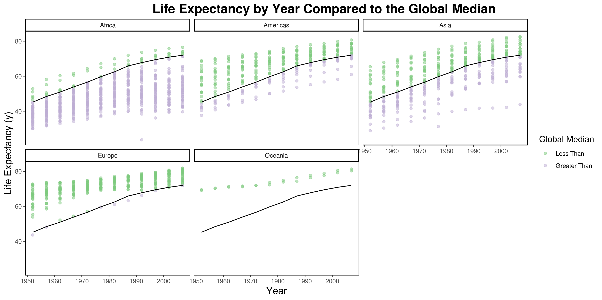
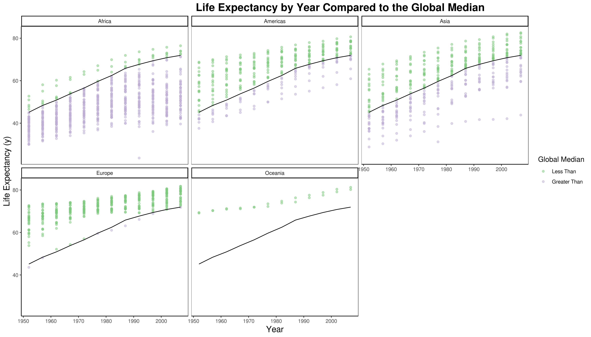

## Introduction

The primary purpose of this assignment is to learn better factor and plot management. This involved manipulating factors to achieve a goal and manipulating plots aesthetics at a more advanced level. The auxiliary goals are to read and write data to a file and generating a plotly visual.

The [assignment](http://stat545.com/Classroom/assignments/hw05/hw05.html) is described as follows:

> Goals:
>
> - Reorder a factor in a principled way based on the data and demonstrate the effect in arranged data and in figures.
> - Write some data to file and load it back into R.
> - Improve a figure (or make one from scratch), using new knowledge, e.g., control the color scheme, use factor levels, smoother mechanics.
> - Make a plotly visual.
> - Implement visualization design principles.

For this assignment, I will be using the gapminder.

```{r libraryImport}
suppressPackageStartupMessages(library(tidyverse))
suppressPackageStartupMessages(library(gapminder))
suppressPackageStartupMessages(library(scales))
suppressPackageStartupMessages(library(plotly))
```

## Part 1: Factor management

This part of the assignement is described as follows:

> With the data set of your choice, after ensuring the variable(s) you’re exploring are indeed factors, you are expected to:
>
> - Drop factor / levels;
> - Reorder levels based on knowledge from data.
> - We’ve elaborated on these steps for the gapminder and singer data sets below.
> 
> Be sure to also characterize the (derived) data before and after your factor re-leveling:
> 
> - Explore the effects of arrange(). Does merely arranging the data have any effect on, say, a figure?
> - Explore the effects of reordering a factor and factor reordering coupled with arrange(). Especially, what effect does this have on a figure?
>
> These explorations should involve the data, the factor levels, and some figures.

For the gapminder data specifically, the assignment says:

> Elaboration for the gapminder data set
> __Drop Oceania__. Filter the Gapminder data to remove observations associated with the continent of Oceania. Additionally, remove unused factor levels. Provide concrete information on the data before and after removing these rows and Oceania; address the number of rows and the levels of the affected factors.

> __Reorder the levels of country or continent__. Use the forcats package to change the order of the factor levels, based on a principled summary of one of the quantitative variables. Consider experimenting with a summary statistic beyond the most basic choice of the median.

First, I will remove Oceania and remove any unused factor levels. I will then show the differences before the data frame before and after.

```{r dropOceania = 'asis'}
# Look at the levels of continent before any changes are made
gapminder %>%
    pull(continent) %>%
    fct_count() %>%
    knitr::kable()

# First, I will just drop Oceania and example the result
gapNoOceania = gapminder %>%
    filter(continent != "Oceania")

# Comparing the number of rows before and after
print(sprintf("The gapminder has %d rows by default and %d rows after all rows with Oceania have been filered out.", nrow(gapminder), nrow(gapNoOceania)))

# Here, we can see that all of the rows with Oceania as a row have been filtered out, but it remains a level in the factor
gapNoOceania %>%
    pull(continent) %>%
    fct_count() %>%
    knitr::kable()

# Now, we would like to remove the extra levels using the droplevels function
gapNoOceaniaDropLevels = gapNoOceania %>%
    droplevels()

# Comparing the number of rows before and after
print(sprintf("The gapminder has %d rows by default and %d rows after all rows with Oceania have been filered out and unused factor levels have been dropped.", nrow(gapminder), nrow(droplevels(gapNoOceaniaDropLevels))))

# The Oceania level has now been dropped for the continent factor
gapNoOceaniaDropLevels %>%
    pull(continent) %>%
    fct_count() %>%
    knitr::kable()
```

The above code chunk shows how, if we simply filter out all levels at a given factor level, the factor object itself remains unchanged. When all rows with a continent of Oceania were filtered out, the number of rows decreased but the factor retained all levels. When the unused factor levels were dropped, we can see that the row number remained the same, but the factor itself was changed to no longer include Oceania.

This is due to the distinction between the levels and elements of a factor. The levels of a vector are internally stored as integers, each of which maps to an element of a character vector. This character vector contains the name of each level, like Oceania. The elements of a factor are simply integers that map one of these levels. A factor does not need all of the levels to be mapped to for the levels to exist. When all rows with Oceania were filetered out, the _elements_ of the continents column factor were changed, but the _levels_ were not. Similarly, when the unused levels were dropped, the _levels_ of the factor were changed, but not the _elements_.

The next task is to reorder the levels of continent based on a summary statistic of one of the quantitative columns. I will chose to reorder the columns based on the interquartile range of the GDP per capita.

```{r reorderColumnsByFactor, fig.width=10, fig.height=5}
# First, I would like to simply reorder the columns based on the iqr of the columns
gapminder %>%
    mutate(continent = fct_reorder(continent, gdpPercap, IQR)) %>%
    ggplot(aes(continent, y = gdpPercap, colour = continent)) +
    geom_boxplot() +
    theme_bw()
```

On a boxplot, the box includes the interquartile range (IQR). By ordering by the IQR, from smallest to largest, I have made it so that the boxes increase in length, from left to right, for this plot.

I will go further than the basic task to investigate reordering factors even further.

There are a few more options for reordering based on a factor. For example, say I worked for the European Union. Then, I might want to choose to have it ordered first. Maybe I would also want to make Europe look good, so I wanted the rest ordered from lowest median GDP per capita to the highest.

```{r reorderColumnsByFactorExtra, fig.width=10, fig.height=5}
# First, I would like to simply reorder the columns based on the iqr of the columns
gapminder %>%
    mutate(continent = fct_reorder(continent, gdpPercap), 
           continent = fct_relevel(continent, "Europe")) %>%
    ggplot(aes(continent, y = gdpPercap, colour = continent)) +
    geom_boxplot() +
    theme_bw()
```

From this, we can see it is possible to combine a principled summary ordering with an arbitrary reordering.

We also want to see how arrange works and how it interact with a factor reordering.

```{r reorderAndArrange = 'asis', fig.width=10, fig.height=5}
# Arrange changes the order of the rows based on a columns
# In this case, descending order based on continent
gapminder %>%
    group_by(continent) %>%
    summarise(meanLifeExp = mean(lifeExp)) %>%
    arrange(desc(continent)) %>%
    knitr::kable()

# However,this does not change the factor itself
gapminder %>%
    group_by(continent) %>%
    summarise(meanLifeExp = mean(lifeExp)) %>%
    arrange(desc(continent)) %>%
    pull(continent) %>%
    levels()

# This means that it does not affect the order in figures
gapminder %>%
    group_by(continent, year) %>%
    summarise(meanLifeExp = mean(lifeExp)) %>%
    arrange(desc(continent)) %>%
    ggplot(aes(continent, y = meanLifeExp, colour = continent)) +
    geom_boxplot() +
    theme_bw()

# We have already seen the effects of a factor reordering on a figure
# Therefore, we will see how a factor re-ording and a arrange interact to form a plot
# To do this, I will put several countries so I have two factors to work with
gapminder %>%
    filter(country %in% c("Canada", "Mexico", "France")) %>%
    mutate(country = fct_reorder(country, lifeExp)) %>%
    arrange(desc(lifeExp)) %>%
    ggplot(aes(x = year, y = lifeExp, colour = country)) + 
    geom_line() +
    theme_bw()
```

Arrange acts on the row order, but not any factor objects, while a factor reorder works on the factor object. One result of this is that arrange does not affect the resutls in a plot, but the factor reorder does. Further, an arrange will not change the effect of a factor reorder. This is because the factor level data is not affected by the order of the individual elements of the factor.

## Part 2: File I/O

This task is described as follows:

> Experiment with one or more of write_csv()/read_csv() (and/or TSV friends), saveRDS()/readRDS(), dput()/dget(). Create something new, probably by filtering or grouped-summarization of Singer or Gapminder. I highly recommend you fiddle with the factor levels, i.e. make them non-alphabetical (see previous section). Explore whether this survives the round trip of writing to file then reading back in.

I will first make a small data frame to use for this section, summarizing the data by continent and shuffling continent levels. I am doing this because a smaller dataset will be easier to use and, by shuffling continent levels, we will be able to observe how the object metadata is stored in different data types.

```{r shuffleColumns = 'asis'}
# Store and shuffle the data
gapShuffle = gapminder %>%
    group_by(continent) %>%
    summarise(meanLifeExp = mean(lifeExp)) %>%
    mutate(continent = fct_shuffle(continent))

# Look at the current data frame
gapShuffle %>%
    knitr::kable()

# We can see that the levels have been shuffled for continent
# Gapminder
gapminder %>%
    pull(continent) %>%
    levels()
# Shuffled
gapShuffle %>%
    pull(continent) %>%
    levels()
# See that the levels are not in the same order
```

Lets look at the read/write csv functions. For this I will get by getting the mean of life expectancies by continent, randomly shuffle the levels of the gapminder dataset, write it to a file, and then see whether the data is changed.

```{r csvExample = 'asis'}
# Write to csv
gapShuffle %>%
    write_csv("./gapShuffle.csv", append = FALSE, col_names = TRUE)

# Read from csv
gapShuffleCsv = read_csv("./gapShuffle.csv")
# Look at the data frame
gapShuffleCsv %>%
    knitr::kable()
# Look at the structure
str(gapShuffleCsv)
```

There are two important things to notice. The order of the rows was maintained and the continent column is now a character column. This is because normal csv's do not contain metadata. In the case of a factor column, the level order is contained in the metadata.

Now, lets see what the same thing is done using an rds file. An rds file contains a serialized R object. This means that all of the information about the stored object is converted into a format to store in a file.

```{r rdsExample = 'asis'}
# Write to rds
gapShuffle %>%
    write_rds("./gapShuffle.rds")

# Read from rds
gapShuffleRds = read_rds("./gapShuffle.rds")

# Is the continent column a factor?
is.factor(gapShuffleRds$continent)

# Look at the data frame
gapShuffleRds %>%
    knitr::kable()

# See if the levels have the same order
gapShuffleRds %>%
    pull(continent) %>%
    levels()
```

Notice that the continent column is still a factor and maintains the same order as before. This is because the metadata is stored in an dput file. As with the csv, the row order is maintained.

One important thing to note is that dput files contain more data in a more complicated format than a csv, so will take up more storage than a csv storing the same data frame. Also, dput is specific to R, so will be less portable.

Finally, lets look at dput/dget. This writes an R object to a file in ASCII. This file type also contains metadata.

```{r dputExample = 'asis'}
# Write with dput
gapShuffle %>%
    dput("./gapShuffle.dput")

# Read from dput
gapShuffleDput = dget("./gapShuffle.dput")

# Is the continent column a factor?
is.factor(gapShuffleDput$continent)

# Look at the data frame
gapShuffleDput %>%
    knitr::kable()

# See if the levels have the same order
gapShuffleDput %>%
    pull(continent) %>%
    levels()

# If we don't specify the object type, we can see the result is the same code you could enter in an R console
gapShuffle %>%
    dput()
```

This function also maintains the factor order and the row order, as it stores the object meta data. The output of dput is the same code you could use to enter the object into an R console. This can be useful in certain cases.

However, this storage method is very inefficient, so will take up much more storage than a csv to store the same data.

## Part 3: Visualization Design

> Remake at least one figure or create a new one, in light of something you learned in the recent class meetings about visualization design and color. Maybe juxtapose your first attempt and what you obtained after some time spent working on it. Reflect on the differences. If using Gapminder, you can use the country or continent color scheme that ships with Gapminder. Consult the dimensions listed in All the Graph Things.
>
> Then, make a new graph by converting this visual (or another, if you’d like) to a plotly graph. What are some things that  plotly makes possible, that are not possible with a regular ggplot2 graph?

For this section of the assignement, I want to use the `gapminder` data set to recreate a plot of `lifeExp` by `year`, faceted by `continent`. from homework 3 with the new theme information. The focus of this section is on visual design, so the bulk of this section will focus on the logic for the different visual design choices.

This is the basic plot from hw03 without any additional formatting.

```{r basePlot, fig.width=10, fig.height=5}
gapminder %>%
  group_by(year) %>%
  mutate(worldMedian = median(lifeExp), 
         lessThanMedian = lifeExp < worldMedian) %>%
  ggplot(aes(year)) +
  geom_point(aes(y = lifeExp, colour = lessThanMedian)) +
  geom_line(aes(y = worldMedian)) +
  facet_wrap(~continent)
```

My goal for this section is to take away the extraneous design details, like the background colour, and to focus the design on the plot's purpose. The purpose of thisto show the amount of countries in each continent with a life expectancy greater than the global median. Therefore, I think the colour palette should be discrete, to make it easy to distinguish the two groups. I am using the `RColorBrewer` palette `Accent`, as I believe it gives the clearest distinction between the colours. However, I am partially red-green colour blind, so this sometimes leads me to make different choices. I did not choos viridis, as I am not completely colour blind, so I do not require a  colour blind friendly palette.

I have added custom titles to the plot, using the theme to control the size, justification, and face.

This plot uses `theme_classic()` as it's base theme. I chose this theme as it removes most of the extraneous elements, like background colouring, allowing me to select only the necessary elements. This limits plot elements distracting from the plot information. Apart from the titles, the only thing that I added was a panel outline to make the facets stand out. I believe any extra plot elements would be extraneous.

```{r plotWithAddedFormat, fig.width = 10, fig.height = 5}
gapLifeExpByYear = gapminder %>%
  group_by(year) %>%
  mutate(worldMedian = median(lifeExp), 
         lessThanMedian = lifeExp < worldMedian) %>%
  ggplot(aes(year)) +
  geom_point(aes(y = lifeExp, colour = lessThanMedian), alpha = 0.5) +
  scale_colour_brewer(
    palette = "Accent",
    name = "Global Median",
    labels = c("Less Than", "Greater Than")
  ) + 
  geom_line(aes(y = worldMedian)) +
  ggtitle("Life Expectancy by Year Compared to the Global Median") +
  labs(x = "Year", y = "Life Expectancy (y)") +
  facet_wrap(~continent) +
  theme_classic() + 
  theme(axis.title =  element_text(size = 14),
    plot.title = element_text(
      size = 18, 
      hjust = 0.8, 
      face = "bold"),
    legend.title = element_text(size = 12),
    panel.background = element_rect(
      colour = "black",
      size = 0.25
    )
  )
gapLifeExpByYear
```

I believe this plot more clearly communicates the number of countries above and below the world median life expectancy. By choosing a high contrast colour palette and removing unneeded plot elements, it provides an easy and visually appealing presentation of information.

Next, I will create an equivalent plotly plot. Plotly does not have good support for facetting on a factor like ggplot, so, to achieve a similar effect, I will need to use a loop to achieve the same effect

```{r plotlyPlot, fig.width = 10, fig.height = 5}
nContinent = length(unique(gapminder$continent))
plotlyList = vector("list", nContinent)

for(i in 1:nContinent)
{
  plotlyList[[i]] = gapminder %>%
    group_by(year) %>%
    mutate(worldMedian = median(lifeExp), 
           lessThanMedian = lifeExp < worldMedian) %>%
    ungroup() %>%
    filter(continent == levels(gapminder$continent)[i]) %>%
    plot_ly(x = ~year) %>%
    add_markers(
      y = ~lifeExp,
      color = ~lessThanMedian,
      colors = "Accent",
      opacity = 0.5) %>%
    add_lines(
      y = ~worldMedian,
      line = list(color = '#07A4B5')) %>%
    layout(title = 'Life Expectancy By Year Compared to the Global Median',
         xaxis = list(title = ""),
         yaxis = list(side = 'left', title = 'Life Expectancy (years)', showgrid = FALSE, zeroline = FALSE),
         showlegend = FALSE)
}

subplot(plotlyList, shareX = TRUE, nrows = 2) %>% 
  layout(annotations = list(
  list(x = 0 , y = 0.5, text = "Africa", showarrow = F, xref='paper', yref='paper'),
  list(x = 0.38 , y = 0.5, text = "America", showarrow = F, xref='paper', yref='paper'),
  list(x = .7 , y = 0.48, text = "Asia", showarrow = F, xref='paper', yref='paper'),
  list(x = 0 , y = -0.1, text = "Europe", showarrow = F, xref='paper', yref='paper'),
  list(x = 0.38 , y = -0.1, text = "Oceania", showarrow = F, xref='paper', yref='paper'))
)
```
This is a nearly equivalent plot made using plotly. Plotting based on a factor requires much more work than in `ggplot`, but it has a nice effect. Plotly will also automatically add each subplot's elements to the legend. This causes problems when they are plots split by factor, like the above. However, the colour scheme is very clearly divided between above and below the median, so I decided it could be removed. Finally, the continent labels had to be added manually and had limitted formatting options.

The biggest features that I found plotly had that ggplot did not was interactivity. User can select and zoom with plot, see the coordinates of a point, and, through this, get a feel for the data in a way that is not possible with ggplot. It also automatically combines the legends of multiple subplots, which could be very useful in a different circumstance. 

## Part 4: Writing Figures to File

> Use ggsave() to explicitly save a plot to file. Then use !\[Alt text](/path/to/img.png) to load and embed it in your report. You can play around with various options, such as:
> 
> Arguments of ggsave(), such as width, height, resolution or text scaling.
> Various graphics devices, e.g. a vector vs. raster format.
> Explicit provision of the plot object p via ggsave(..., plot = p). Show a situation in which this actually matters.

In this section, I will explore how to save a ggplot to file using `ggsave()`. I will use the plot from the previous section as an example plot. First, I will try saving the plot with several different arugments and then examine the result.

```{r ggsaveArg}
ggsave("testPlot1.png", units = "cm", width = 30, height = 15)
ggsave("testPlot2.bmp", device = "bmp", units = "cm", width = 30, height = 15, scale = 0.5)
ggsave("testPlot3.jpeg", device = "jpeg",units = "cm", width = 35, height = 20)
```

The three different plots that were saved for this section with different parameters. They were each saved with different parameters. 

The first plot was saved in a raster image format, png.



The second image was saved as a pdf image, with a different scale, but the same size.


Finally, the third image was saved as a jpeg with different height and width settings.



The first image is quite nice. It is a raster image, which means it will not scale as well as a vector image, as it is defined in terms of pixels rather than vectors. The second image looks blown up. However, this is because it was scaled down using the scale parameter to half of the size given in the width and height arguments. As the text was a pre-defined size, this caused the text to look much bigger compared to the plots, as it does in this image. Finally, the jpeg plot has been saved with different width and height parameters. However, this image was resized to fit the page, so this is not visible.


## But I want to do more

For this section, I will recode a small set of countries to one of their most famous cheeses.

```{r cheesyFactors}
gapminder %>%
  filter(country %in% c("United States", "France", "Switzerland", "Italy", "Ireland")) %>%
  droplevels() %>%
  mutate(country = fct_recode(country, kraftSingles = "United States", roquefort = "France", swiss = "Switzerland", parmesan = "Italy", irishCheddar = "Ireland")) %>%
  pull(country) %>%
  levels()
```

What this did is filter out a small subset of countries, drop unused levels, map the countries to their famous cheeses, and then pull the remapped countries to display the results!