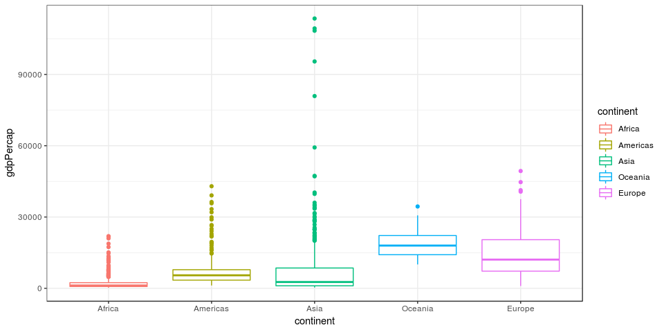

STAT 545A - Homework 5: Factors and figure management
================
Glenn McGuinness

-   [Introduction](#introduction)
-   [Part 1: Factor management](#part-1-factor-management)
-   [Part 2: File I/O](#part-2-file-io)

Introduction
------------

The primary purpose of this assignment is to learn better factor and plot management. This involved manipulating factors to achieve a goal and manipulating plots aesthetics at a more advanced level. The auxiliary goals are to read and write data to a file and generating a plotly visual.

The [assignment](http://stat545.com/Classroom/assignments/hw05/hw05.html) is described as follows:

> Goals:
>
> -   Reorder a factor in a principled way based on the data and demonstrate the effect in arranged data and in figures.
> -   Write some data to file and load it back into R.
> -   Improve a figure (or make one from scratch), using new knowledge, e.g., control the color scheme, use factor levels, smoother mechanics.
> -   Make a plotly visual.
> -   Implement visualization design principles.

For this assignment, I will be using the gapminder.

``` r
suppressPackageStartupMessages(library(tidyverse))
suppressPackageStartupMessages(library(gapminder))
```

Part 1: Factor management
-------------------------

This part of the assignement is described as follows:

> With the data set of your choice, after ensuring the variable(s) you’re exploring are indeed factors, you are expected to:
>
> -   Drop factor / levels;
> -   Reorder levels based on knowledge from data.
> -   We’ve elaborated on these steps for the gapminder and singer data sets below.
>
> Be sure to also characterize the (derived) data before and after your factor re-leveling:
>
> -   Explore the effects of arrange(). Does merely arranging the data have any effect on, say, a figure?
> -   Explore the effects of reordering a factor and factor reordering coupled with arrange(). Especially, what effect does this have on a figure?
>
> These explorations should involve the data, the factor levels, and some figures.

For the gapminder data specifically, the assignment says:

> Elaboration for the gapminder data set **Drop Oceania**. Filter the Gapminder data to remove observations associated with the continent of Oceania. Additionally, remove unused factor levels. Provide concrete information on the data before and after removing these rows and Oceania; address the number of rows and the levels of the affected factors.

> **Reorder the levels of country or continent**. Use the forcats package to change the order of the factor levels, based on a principled summary of one of the quantitative variables. Consider experimenting with a summary statistic beyond the most basic choice of the median.

First, I will remove Oceania and remove any unused factor levels. I will then show the differences before the data frame before and after.

``` r
# Look at the levels of continent before any changes are made
gapminder %>%
    pull(continent) %>%
    fct_count() %>%
    knitr::kable()
```

| f        |    n|
|:---------|----:|
| Africa   |  624|
| Americas |  300|
| Asia     |  396|
| Europe   |  360|
| Oceania  |   24|

``` r
# First, I will just drop Oceania and example the result
gapNoOceania = gapminder %>%
    filter(continent != "Oceania")

# Comparing the number of rows before and after
print(sprintf("The gapminder has %d rows by default and %d rows after all rows with Oceania have been filered out.", nrow(gapminder), nrow(gapNoOceania)))
```

    ## [1] "The gapminder has 1704 rows by default and 1680 rows after all rows with Oceania have been filered out."

``` r
# Here, we can see that all of the rows with Oceania as a row have been filtered out, but it remains a level in the factor
gapNoOceania %>%
    pull(continent) %>%
    fct_count() %>%
    knitr::kable()
```

| f        |    n|
|:---------|----:|
| Africa   |  624|
| Americas |  300|
| Asia     |  396|
| Europe   |  360|
| Oceania  |    0|

``` r
# Now, we would like to remove the extra levels using the droplevels function
gapNoOceaniaDropLevels = gapNoOceania %>%
    droplevels()

# Comparing the number of rows before and after
print(sprintf("The gapminder has %d rows by default and %d rows after all rows with Oceania have been filered out and unused factor levels have been dropped.", nrow(gapminder), nrow(droplevels(gapNoOceaniaDropLevels))))
```

    ## [1] "The gapminder has 1704 rows by default and 1680 rows after all rows with Oceania have been filered out and unused factor levels have been dropped."

``` r
# The Oceania level has now been dropped for the continent factor
gapNoOceaniaDropLevels %>%
    pull(continent) %>%
    fct_count() %>%
    knitr::kable()
```

| f        |    n|
|:---------|----:|
| Africa   |  624|
| Americas |  300|
| Asia     |  396|
| Europe   |  360|

The above code chunk shows how, if we simply filter out all levels at a given factor level, the factor object itself remains unchanged. When all rows with a continent of Oceania were filtered out, the number of rows decreased but the factor retained all levels. When the unused factor levels were dropped, we can see that the row number remained the same, but the factor itself was changed to no longer include Oceania.

This is due to the distinction between the levels and elements of a factor. The levels of a vector are internally stored as integers, each of which maps to an element of a character vector. This character vector contains the name of each level, like Oceania. The elements of a factor are simply integers that map one of these levels. A factor does not need all of the levels to be mapped to for the levels to exist. When all rows with Oceania were filetered out, the *elements* of the continents column factor were changed, but the *levels* were not. Similarly, when the unused levels were dropped, the *levels* of the factor were changed, but not the *elements*.

The next task is to reorder the levels of continent based on a summary statistic of one of the quantitative columns. I will chose to reorder the columns based on the interquartile range of the GDP per capita.

``` r
# First, I would like to simply reorder the columns based on the iqr of the columns
gapminder %>%
    mutate(continent = fct_reorder(continent, gdpPercap, IQR)) %>%
    ggplot(aes(continent, y = gdpPercap, colour = continent)) +
    geom_boxplot() +
    theme_bw()
```



On a boxplot, the box includes the interquartile range (IQR). By ordering by the IQR, from smallest to largest, I have made it so that the boxes increase in length, from left to right, for this plot.

I will go further than the basic task to investigate reordering factors even further.

There are a few more options for reordering based on a factor. For example, say I worked for the European Union. Then, I might want to choose to have it ordered first. Maybe I would also want to make Europe look good, so I wanted the rest ordered from lowest median GDP per capita to the highest.

``` r
# First, I would like to simply reorder the columns based on the iqr of the columns
gapminder %>%
    mutate(continent = fct_reorder(continent, gdpPercap), 
           continent = fct_relevel(continent, "Europe")) %>%
    ggplot(aes(continent, y = gdpPercap, colour = continent)) +
    geom_boxplot() +
    theme_bw()
```


From this, we can see it is possible to combine a principled summary ordering with an arbitrary reordering.

Part 2: File I/O
----------------

This task is described as follows:

> Experiment with one or more of write\_csv()/read\_csv() (and/or TSV friends), saveRDS()/readRDS(), dput()/dget(). Create something new, probably by filtering or grouped-summarization of Singer or Gapminder. I highly recommend you fiddle with the factor levels, i.e. make them non-alphabetical (see previous section). Explore whether this survives the round trip of writing to file then reading back in.

I will first make a small data frame to use for this section, summarizing the data by continent and shuffling continent levels. I am doing this because a smaller dataset will be easier to use and, by shuffling continent levels, we will be able to observe how the object metadata is stored in different data types.

``` r
# Store and shuffle the data
gapShuffle = gapminder %>%
    group_by(continent) %>%
    summarise(meanLifeExp = mean(lifeExp)) %>%
    mutate(continent = fct_shuffle(continent))

# Look at the current data frame
gapShuffle %>%
    knitr::kable()
```

| continent |  meanLifeExp|
|:----------|------------:|
| Africa    |     48.86533|
| Americas  |     64.65874|
| Asia      |     60.06490|
| Europe    |     71.90369|
| Oceania   |     74.32621|

``` r
# We can see that the levels have been shuffled for continent
# Gapminder
gapminder %>%
    pull(continent) %>%
    levels()
```

    ## [1] "Africa"   "Americas" "Asia"     "Europe"   "Oceania"

``` r
# Shuffled
gapShuffle %>%
    pull(continent) %>%
    levels()
```

    ## [1] "Europe"   "Asia"     "Africa"   "Oceania"  "Americas"

``` r
# See that the levels are not in the same order
```

Lets look at the read/write csv functions. For this I will get by getting the mean of life expectancies by continent, randomly shuffle the levels of the gapminder dataset, write it to a file, and then see whether the data is changed.

``` r
# Write to csv
gapShuffle %>%
    write_csv("./gapShuffle.csv", append = FALSE, col_names = TRUE)

# Read from csv
gapShuffleCsv = read_csv("./gapShuffle.csv")
```

    ## Parsed with column specification:
    ## cols(
    ##   continent = col_character(),
    ##   meanLifeExp = col_double()
    ## )

``` r
# Look at the data frame
gapShuffleCsv %>%
    knitr::kable()
```

| continent |  meanLifeExp|
|:----------|------------:|
| Africa    |     48.86533|
| Americas  |     64.65874|
| Asia      |     60.06490|
| Europe    |     71.90369|
| Oceania   |     74.32621|

``` r
# Look at the structure
str(gapShuffleCsv)
```

    ## Classes 'tbl_df', 'tbl' and 'data.frame':    5 obs. of  2 variables:
    ##  $ continent  : chr  "Africa" "Americas" "Asia" "Europe" ...
    ##  $ meanLifeExp: num  48.9 64.7 60.1 71.9 74.3
    ##  - attr(*, "spec")=List of 2
    ##   ..$ cols   :List of 2
    ##   .. ..$ continent  : list()
    ##   .. .. ..- attr(*, "class")= chr  "collector_character" "collector"
    ##   .. ..$ meanLifeExp: list()
    ##   .. .. ..- attr(*, "class")= chr  "collector_double" "collector"
    ##   ..$ default: list()
    ##   .. ..- attr(*, "class")= chr  "collector_guess" "collector"
    ##   ..- attr(*, "class")= chr "col_spec"

There are two important things to notice. The order of the rows was maintained and the continent column is now a character column. This is because normal csv's do not contain metadata. In the case of a factor column, the level order is contained in the metadata.

Now, lets see what the same thing is done using an rds file. An rds file contains a serialized R object. This means that all of the information about the stored object is converted into a format to store in a file.

``` r
# Write to rds
gapShuffle %>%
    write_rds("./gapShuffle.rds")

# Read from rds
gapShuffleRds = read_rds("./gapShuffle.rds")

# Is the continent column a factor?
is.factor(gapShuffleRds$continent)
```

    ## [1] TRUE

``` r
# Look at the data frame
gapShuffleRds %>%
    knitr::kable()
```

| continent |  meanLifeExp|
|:----------|------------:|
| Africa    |     48.86533|
| Americas  |     64.65874|
| Asia      |     60.06490|
| Europe    |     71.90369|
| Oceania   |     74.32621|

``` r
# See if the levels have the same order
gapShuffleRds %>%
    pull(continent) %>%
    levels()
```

    ## [1] "Europe"   "Asia"     "Africa"   "Oceania"  "Americas"

Notice that the continent column is still a factor and maintains the same order as before. This is because the metadata is stored in an dput file. As with the csv, the row order is maintained.

One important thing to note is that dput files contain more data in a more complicated format than a csv, so will take up more storage than a csv storing the same data frame. Also, dput is specific to R, so will be less portable.

Finally, lets look at dput/dget. This writes an R object to a file in ASCII. This file type also contains metadata.

``` r
# Write with dput
gapShuffle %>%
    dput("./gapShuffle.dput")

# Read from dput
gapShuffleDput = dget("./gapShuffle.dput")

# Is the continent column a factor?
is.factor(gapShuffleDput$continent)
```

    ## [1] TRUE

``` r
# Look at the data frame
gapShuffleDput %>%
    knitr::kable()
```

| continent |  meanLifeExp|
|:----------|------------:|
| Africa    |     48.86533|
| Americas  |     64.65874|
| Asia      |     60.06490|
| Europe    |     71.90369|
| Oceania   |     74.32621|

``` r
# See if the levels have the same order
gapShuffleDput %>%
    pull(continent) %>%
    levels()
```

    ## [1] "Europe"   "Asia"     "Africa"   "Oceania"  "Americas"

``` r
# If we don't specify the object type, we can see the result is the same code you could enter in an R console
gapShuffle %>%
    dput()
```

    ## structure(list(continent = structure(c(3L, 5L, 2L, 1L, 4L), .Label = c("Europe", 
    ## "Asia", "Africa", "Oceania", "Americas"), class = "factor"), 
    ##     meanLifeExp = c(48.8653301282051, 64.6587366666667, 60.0649032323232, 
    ##     71.9036861111111, 74.3262083333333)), .Names = c("continent", 
    ## "meanLifeExp"), class = c("tbl_df", "tbl", "data.frame"), row.names = c(NA, 
    ## -5L))

This function also maintains the factor order and the row order, as it stores the object meta data. The output of dput is the same code you could use to enter the object into an R console. This can be useful in certain cases.

However, this storage method is very inefficient, so will take up much more storage than a csv to store the same data.
